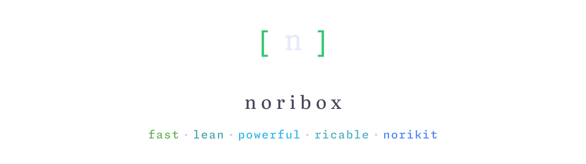

  
  
  

  <picture>
    <source media="(prefers-color-scheme: dark)" srcset="assets/hero-dark.svg"/>
    <source media="(prefers-color-scheme: light)" srcset="assets/hero-light.svg"/>
    
  </picture>

  <strong>noribox</strong> is the omnibox for the <strong>norikit</strong> ecosystem — 
  a third-party launcher in the spirit of Spotlight and Raycast. 
  Open one box to launch apps, run commands, and search everything.

> [!NOTE]
> Work in progress. noribox is in early development and not yet usable.

## License

[AGPL-3.0](LICENSE)
